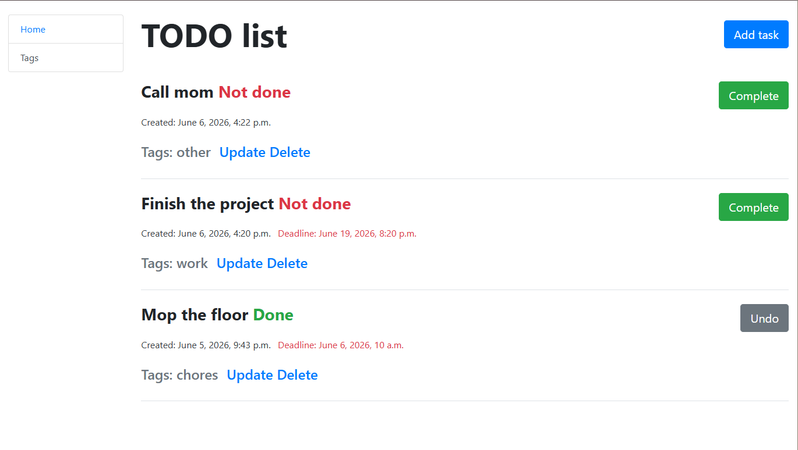

# TO-DO List

## Overview
This is a small and simple project for Mate Academy 
that allows the user to create tasks, set a deadline and track them until completion!
For each task it is possible to add some, if any, tags that correspond to the task (work, chores, etc.)

---

## Tech Stack
- Django (Python)
- SQLite
- HTML, Bootstrap4
- Django Crispy Forms

## Demo

